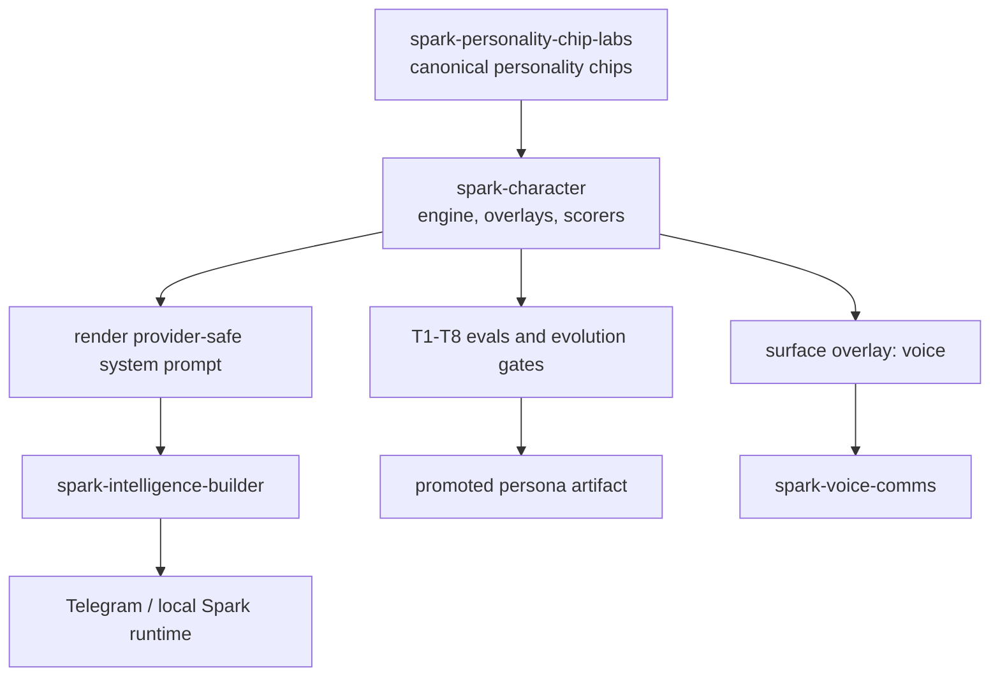

# spark-character

The voice, persona, provider overlays, and conversational quality layer for Spark agents.

This repo keeps Spark feeling like Spark across providers, surfaces, and product modes. It is public character infrastructure, not a place for secrets, raw private transcripts, or live Telegram/runtime credentials.

## What This Is

Spark is a personal-operator agent that can run on top of swappable LLM providers. `spark-character` keeps the agent's identity, conversational taste, emotional range, and provider-specific overlays stable at inference time.

Three things live here:

1. Engine: loads a personality chip from `spark-personality-chip-labs` and renders it into a system prompt with model-agnostic invariants.
2. Evals: T1-T8 scoring for mechanics, voice signature, behavioral traits, multi-turn stability, emotional attunement, memory coherence, and initiative.
3. Evolution loop: mutates the persona, scores candidates, refuses regressions, and promotes winners.

## Current Public Boundary

Public and safe to use:

- Spark's default persona artifacts and provider overlays.
- Scoring and evaluation harnesses for voice consistency.
- Evolution scripts that can run on local or redacted conversation samples.
- Surface overlays, including the voice overlay used by `spark-voice-comms`.

Private or review before sharing:

- Raw Telegram logs.
- Private user preferences.
- Memory exports.
- Provider keys, BotFather tokens, local Spark homes, or generated candidates from private conversations.

`spark-character` pairs with `spark-personality-chip-labs` for portable personality chips and with `spark-voice-comms` for speech I/O. Do not confuse this with the older `spark-voice-engine` work.

## Architecture



Full architectural detail: [docs/ARCHITECTURE.md](docs/ARCHITECTURE.md)

Voice and character boundary notes: [docs/VOICE_CHARACTER_CONNECTIONS_2026-05-09.md](docs/VOICE_CHARACTER_CONNECTIONS_2026-05-09.md)

Open gaps and planned evolutions: [docs/ROADMAP.md](docs/ROADMAP.md)

## Install

Normal Spark users get this module through the starter installer:

```bash
spark setup
```

That installs `spark-character` with the Telegram starter stack so Builder can use the persona runtime without a separate manual clone.

For local development:

```bash
pip install -e .
pip install -e .[dev]
```

## Quick Start

Generate from the canonical chip:

```python
from spark_character import ProviderSpec, load_chip_by_id, persona_from_chip, generate

chip = load_chip_by_id("founder-operator")
persona = persona_from_chip(chip)
provider = ProviderSpec.from_env()

result = generate(
    "Should I raise now or wait six months?",
    provider=provider,
    persona=persona,
)
print(result.final)
```

Generate with the critic rewrite pass:

```python
from spark_character import generate_with_critique

result = generate_with_critique(prompt, provider=provider, persona=persona)
```

Score an arbitrary reply:

```python
from spark_character import score_persona

score = score_persona(some_reply_text)
print(score.passed, score.mean, score.p2_hits)
```

Run the full T1-T8 pulse against a live provider:

```bash
python -u evals/full_pulse.py
```

## Evaluation Tiers

| Tier | What it measures |
| --- | --- |
| T1 mechanics | Em dash, plumbing leaks, reset greetings, hedge openers, voice heuristic. |
| T2 distinctiveness | Whether the reply sounds like Spark instead of a generic helper. |
| T3 behavioral | Disagreement, curiosity, care, identity, honesty, initiative, and sycophancy resistance. |
| T4 stability | Whether identity and boundaries hold across multi-turn pressure. |
| T5 cross-provider | Whether Spark sounds like the same agent on multiple backends. |
| T6 emotional attunement | Whether the reply engages with stated emotional state with substance. |
| T7 memory coherence | Whether the agent acts on facts the user stated earlier. |
| T8 initiative | Whether the agent surfaces implicit problems buried in literal questions. |

## Evolution

```bash
python -u evals/evolve_persona.py --candidates 3
python -u evals/evolve_persona.py --include-deeper
python -u evals/evolve_persona.py --chip-load xcontent,startup-yc
```

Production-grounded evolution can read a local Builder audit log, but do not commit raw logs or private transcripts:

```bash
python -u evals/evolve_persona.py \
  --candidates 3 \
  --sib-home /path/to/spark-intelligence-builder/.tmp-home-live-telegram-real
```

A promoted candidate writes:

- `src/spark_character/artifacts/persona.v(N+1).md`
- an optional sidecar back to `spark-personality-chip-labs`

## Continuous Improvement

```bash
python -u evals/auto_loop.py \
  --sib-home /path/to/spark-intelligence-builder/.tmp-home-live-telegram-real \
  --interval-seconds 1800 \
  --new-replies-threshold 25 \
  --candidates 3
```

The daemon only promotes candidates that beat the baseline without unacceptable regressions. Review private-data boundaries before sharing outputs.

## Repo Layout

```text
src/spark_character/
  artifacts/              persona versions, critic spec, provider overlays
  chip_loader.py          personality chip loading
  persona.py              PersonaSpec and overlay resolution
  critic.py               critic-rewriter pipeline
  pipeline.py             generate and generate_with_critique
  provider.py             OpenAI-compatible provider client
  codex_provider.py       Codex CLI wrapper
  scoring.py              T1 scorers
  voice_judge.py          T2 judge
  probes.py               T3 probes
  stability.py            T4 probes
  deeper_probes.py        T6/T7/T8 probes
  audit_miner.py          local audit-log analysis
  registry.py             promotion helpers

evals/
  full_pulse.py
  cross_provider.py
  evolve_persona.py
  auto_loop.py
```

## Tests

```bash
python -m pytest -q
python -u evals/full_pulse.py
```

Some evals call live providers and require local provider credentials. Keep those credentials in your environment or secret layer, never in this repo.

## License

See [LICENSE](LICENSE) if present in your checkout.
